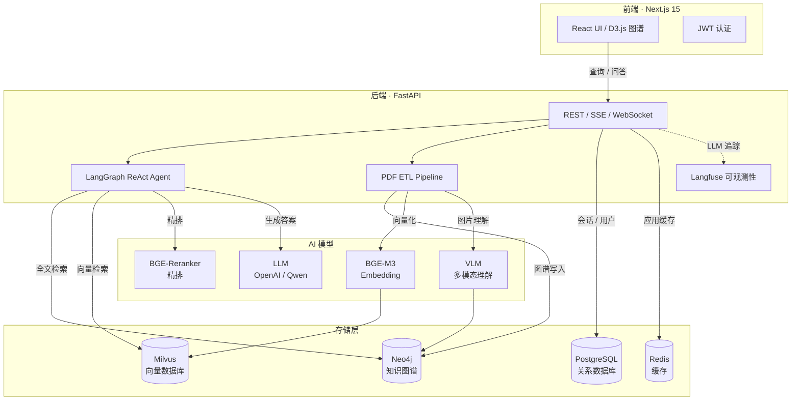
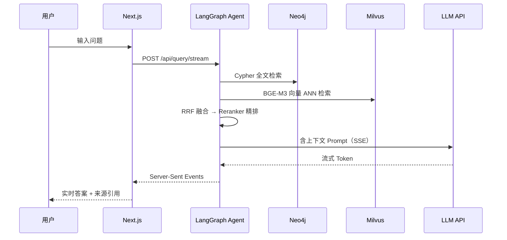
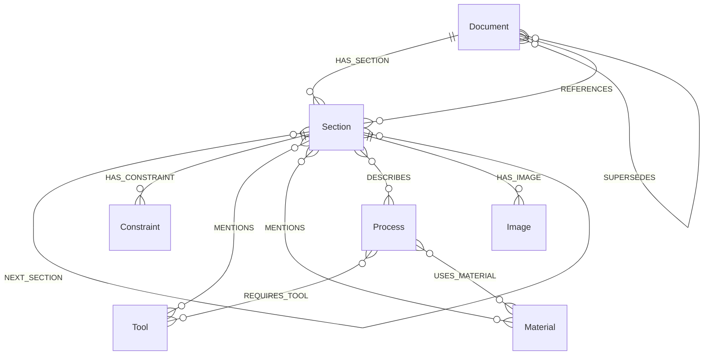
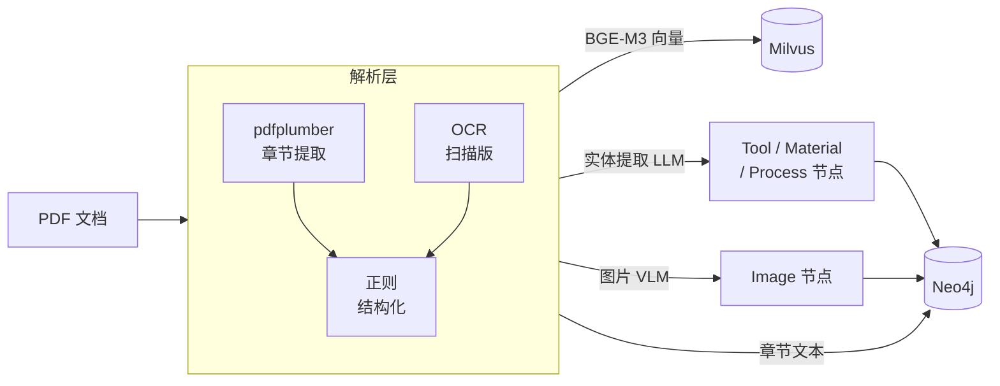

# CPS 知识库 — 航空工艺规范 GraphRAG 系统

> 基于知识图谱与向量检索融合的航空制造工艺规范智能问答系统

---

## 系统架构



---

## 检索问答流程



---

## 知识图谱模式



---

## ETL 入库流程



---

## 技术栈

| 层级 | 技术 |
|------|------|
| 前端 | Next.js 15 · TypeScript · Tailwind CSS · D3.js / PixiJS |
| 后端 | FastAPI 0.115 · Python 3.12 · Pydantic v2 |
| 图数据库 | Neo4j 5.20 · Cypher · GDS（PageRank / Louvain）|
| 向量数据库 | Milvus 2.4 · HNSW 索引 |
| 关系数据库 | PostgreSQL 15 |
| 缓存 | Redis 7 |
| Embedding | BAAI/bge-m3（本地）|
| Reranker | BAAI/bge-reranker-v2-m3（本地）|
| Agent | LangGraph · ReAct · 多跳推理 |
| LLM | OpenAI 兼容 API（硅基流动 / Ollama / vLLM）|
| 可观测性 | Langfuse 2（自托管）|
| 容器化 | Docker Compose · Kubernetes Helm Chart |

---

## 核心功能

| 模块 | 功能 |
|------|------|
| 智能问答 | 两阶段检索（全文+向量）→ RRF 融合 → Reranker 精排 → LLM 生成；SSE 流式输出；多轮对话 |
| 检索策略 | Parallel / Sequential / Graph-Augmented / Multi-hop / GNN / Counterfactual |
| 知识图谱 | D3.js 力导向图；节点/边过滤；子图导出；社区检测（Louvain）；语义链接 |
| 多模态 | PDF 图片提取；VLM 图片语义理解；图文关联查询；扫描版 OCR |
| 文档管理 | PDF 批量导入；自动解析章节结构/引用关系；版本溯源（SUPERSEDES）|
| 数据分析 | 查询/Token/存储/用户多维看板；RAGAS 评估；DataFlywheel 数据飞轮 |
| 管理后台 | 用户管理；Cypher 控制台；实体审核；配额管理；账单中心 |
| 实时监控 | WebSocket 实时仪表盘；OPC-UA 工业数据接入；数字孪生集成 |
| 协作 | 标注/批注；变更影响分析；版本对比；多 Agent 工艺评审（CrewAI）|
| 安全合规 | JWT + RBAC；OPA 细粒度访问控制；审计日志；区块链溯源 |

---

## 快速启动

### 前置条件

- Docker Desktop
- conda（Python 3.12）
- Node.js 20+

### 启动

```bash
# 1. 基础服务（Neo4j / Milvus / PostgreSQL / Redis / Langfuse）
docker compose up -d

# 2. 配置环境变量
cp .env.example .env
# 编辑 .env，填入 LLM_API_URL / LLM_API_KEY / LLM_MODEL

# 3. 后端
conda activate kg-rag
cd backend
python -m uvicorn src.main:app --reload --port 8000

# 4. 前端
cd frontend
npm run dev
```

访问 http://localhost:3000，默认管理员账号：工号 `000001` / 密码 `admin123`。

| 服务 | 地址 |
|------|------|
| 前端 | http://localhost:3000 |
| 后端 API | http://localhost:8000/docs |
| Neo4j Browser | http://localhost:7474 |
| Milvus Attu | http://localhost:8080 |
| Langfuse | http://localhost:3001 |

### 批量导入 PDF

```bash
cd backend
python scripts/batch_ingest.py --dir /path/to/pdfs --skip-existing
```

### 运行测试

```bash
cd backend && python -m pytest tests/ -v
```

---

## 项目结构

```
kg-rag/
├── backend/
│   ├── src/
│   │   ├── routers/        # API 路由（query / ingest / graph / admin …）
│   │   ├── services/       # 业务逻辑（retrieval / agent / etl / llm …）
│   │   ├── models/         # Pydantic 数据模型
│   │   └── main.py
│   ├── scripts/            # ETL / 训练 / 数据导出脚本
│   └── tests/
├── frontend/
│   ├── src/
│   │   ├── app/            # Next.js 页面（query / graph / library / admin …）
│   │   ├── components/     # 可复用组件
│   │   └── lib/            # API 客户端 / 工具函数
│   └── public/
└── docker-compose.yml
```
