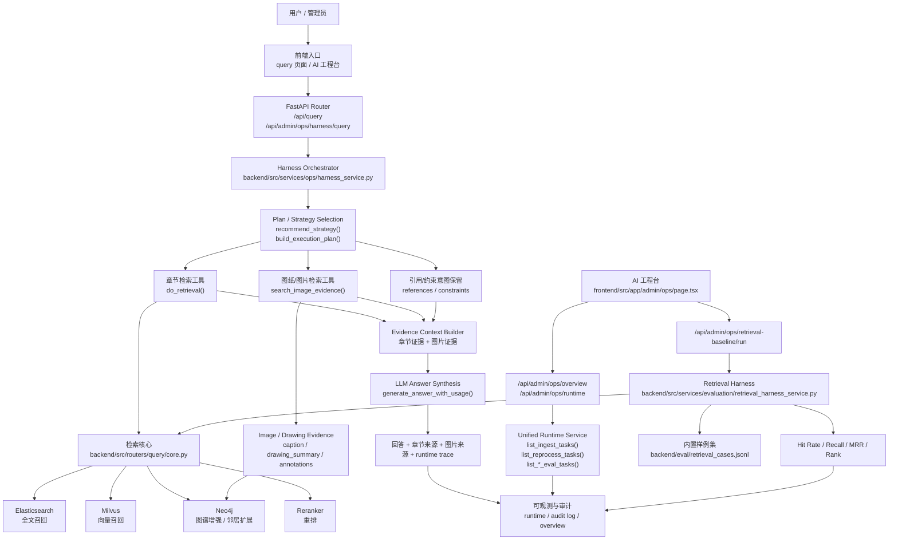

# Harness Engineering Architecture

本文档描述当前系统中 `Harness Engineering` 的核心执行链路、关键模块，以及 `retrieval_cases.jsonl` 在整套工程化体系中的位置。

## 总览

## 模块分层

### 1. Frontend Entry

- 普通问答入口：`frontend/src/app/query`
- 管理员工程入口：`frontend/src/app/admin/ops/page.tsx`

其中 AI 工程台主要承担 3 件事：

- 手动触发 harness 查询
- 触发内置 retrieval baseline 回归
- 查看统一任务运行时与最近审计轨迹

### 2. Router Layer

关键后端入口：

- `backend/src/routers/query/*`
- `backend/src/routers/admin_api/ops.py`

这里负责：

- 接收请求
- 做权限控制
- 将请求转发给 harness / eval / runtime service
- 返回结构化执行结果

### 3. Harness Orchestrator

核心文件：

- `backend/src/services/ops/harness_service.py`

当前 harness 的职责不是“替代所有检索逻辑”，而是把现有能力装配成一个统一执行骨架：

1. `recommend_strategy()`
   根据问题类型推荐检索策略

2. `build_execution_plan()`
   把问题转成可执行计划

3. `run_harness_query()`
   串联章节检索、图纸/图片检索、答案生成和 runtime trace

这就是本系统当前 Harness Engineering 的核心落点。

### 4. Retrieval Toolchain

章节检索实际复用的是现有检索核心：

- `backend/src/routers/query/core.py`

它本身已经封装了多种策略：

- `parallel`
- `sequential`
- `graph_augmented`
- `gnn`

内部会按情况组合：

- Elasticsearch 全文召回
- Milvus 向量召回
- Neo4j 图谱增强
- RRF 融合
- Reranker 重排

所以 harness 并不重写检索，而是“编排检索”。

### 5. Multimodal Evidence

对于图纸/图片类问题，harness 还会调用：

- `search_image_evidence()`

它会从 `Image` 节点中提取证据，重点字段包括：

- `caption`
- `description`
- `drawing_summary`
- `part_numbers`
- `annotations`
- `assembly_relations`

这使系统具备“章节文本 + 图纸图片”的多模态证据融合能力。

### 6. Answer Synthesis

harness 不让模型自己随意搜索，而是先把证据准备好，再统一交给：

- `generate_answer_with_usage()`

其职责是：

- 基于明确证据生成答案
- 尽量降低幻觉
- 保留章节来源与图片来源

### 7. Runtime / Governance / Audit

统一运行时与治理视角由以下模块提供：

- `backend/src/services/ops/runtime_service.py`
- `backend/src/services/ops/audit_service.py`

其中会汇总：

- ingest 任务
- reprocess 任务
- dataset eval 任务
- objective eval 任务
- retrieval eval 任务

并把结果展示到 AI 工程台。

## retrieval_cases.jsonl 的位置

文件位于：

- `backend/eval/retrieval_cases.jsonl`

仓库内还有一个测试专门验证它可被正确解析：

- `backend/tests/test_retrieval_harness_samples.py`

## retrieval_cases.jsonl 的作用

它是当前系统的“内置检索回归样例集”，主要作用有四个：

### 1. 作为检索基线

它定义了一批标准问题及其理想命中目标：

- `question`
- `gold_chunk_ids`
- `gold_doc_ids`
- `domain`
- `strategy`

例如：

- “CPS0200 第一章范围讲的是什么？”
- gold chunk: `CPS0200_1`
- gold doc: `CPS0200`

### 2. 作为 retrieval harness 的输入

由以下服务加载和执行：

- `backend/src/services/evaluation/retrieval_harness_service.py`

主要流程：

1. 读取 `jsonl/csv`
2. 解析为评测行
3. 对每个问题调用 `do_retrieval()`
4. 比较召回结果与 gold
5. 计算指标

### 3. 作为工程台的一键回归样例集

AI 工程台会通过：

- `/api/admin/ops/retrieval-baseline/run`

直接加载该文件并启动回归任务。

这意味着该文件已经进入系统的正式工程回归链路，而不只是一个静态示例。

### 4. 作为持续扩充的业务样本池

后续可以继续往里面增加：

- 第一章“范围”类问题
- 图纸检索问题
- 引用链问题
- 章节定位问题
- 多文档对比问题
- 参数/约束问题

样例越完整，系统的回归能力越强。

## 当前 Harness Engineering 的特点

和普通“RAG + LLM”相比，本系统当前的特点是：

- 先选策略，再执行，而不是直接生成
- 使用工具链编排，而不是依赖模型隐式推理
- 支持章节与图纸的多模态证据融合
- 支持统一 runtime、审计、治理视图
- 支持用 `retrieval_cases.jsonl` 做内置检索回归

## 后续可继续增强的方向

当前还是 MVP 形态，后续可往更完整的 Harness Engineering 演进：

- 增加 `reflect / self-check` 环节
- 增加真正的 `reference_trace` 独立工具
- 增加 query rewrite / planner memory
- 增加多 Agent 协作
- 增加线上真实问题自动沉淀为回归样本

